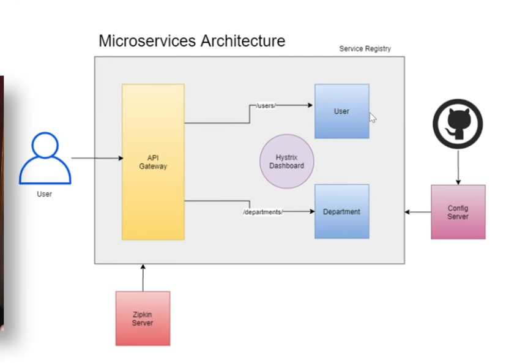
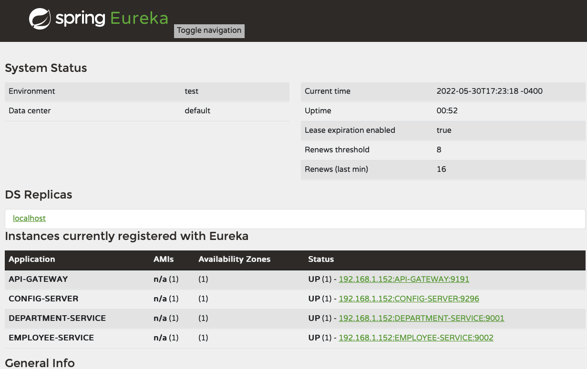
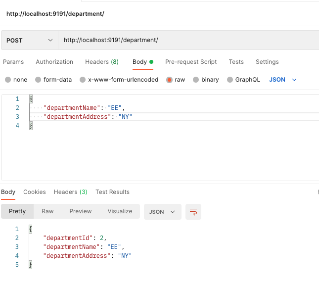
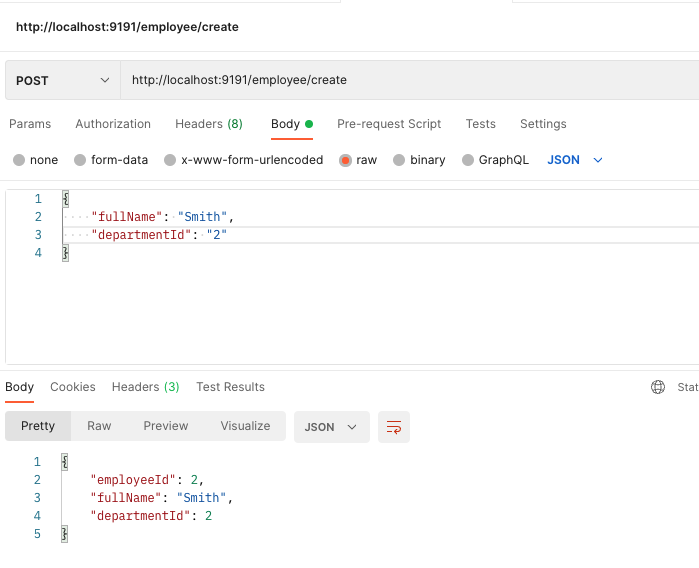
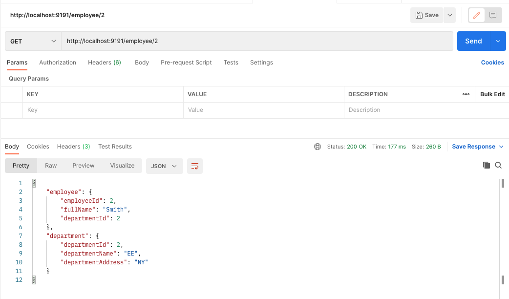

# Micro-services using Spring Boot, Docker & Kubernetes

Creating two Micro services for Employee and Departments on Port 9002 & 9001

Setting up a Service Registry using Eureka Server
Listening at Port 8761

## Project Backlog

Implement Resilience 4j CircuitBreaker, Retry and Rate Limiter
Deploy using Docker and kubernetes
Add docker File and make container

### Microservices Architecture

### Eureka Service Registry

### API Gateway

API gateway is running on http://localhost:9191/

### REST Client POSTMAN Examples

Create departments by using a micro service using the API gateway

Create User by using another microservice

Get Employee by calling employee service and that calls department service internally

inspired from https://github.com/shabbirdwd53/Springboot-Microservice
Hysterix has been deprecated and replaced with Resilience4j
